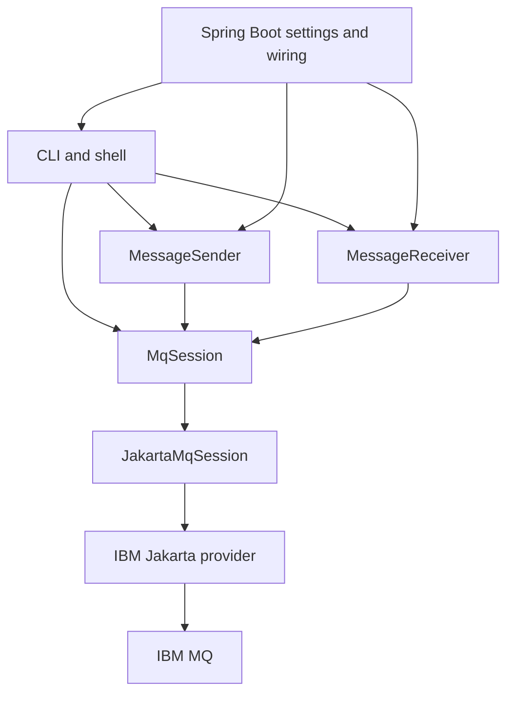
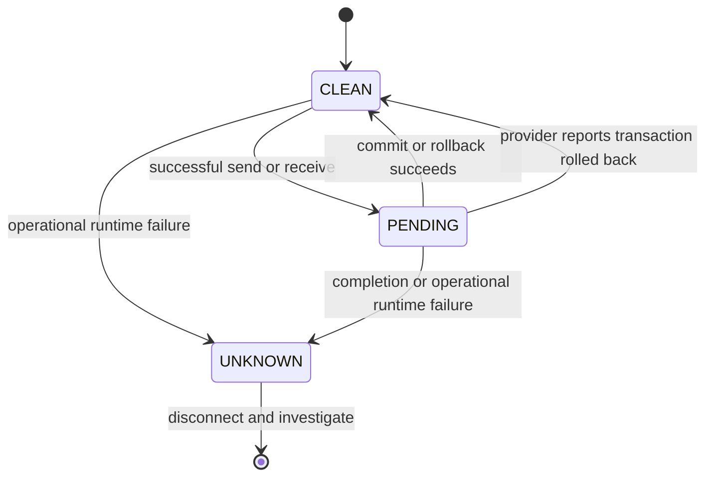

# Application-managed Jakarta Messaging

The application owns each context's lifecycle and transaction. Spring never receives a JMSContext bean or a Spring-managed messaging transaction. The one-shot services use `try` with a `MqSession`; shell owns one until disconnect/quit. The transport creates the IBM factory, obtains `createContext(user, password, SESSION_TRANSACTED)` and closes it explicitly. No caching/pooling or background scheduler is installed. Jakarta's simplified API combines the Connection and Session concepts; it does not remove them.

## Mapping from the native lab

| Native lab                      | Jakarta lab                                 | Difference                                                   |
|---------------------------------|---------------------------------------------|--------------------------------------------------------------|
| `MQQueueManager` construction   | `ConnectionFactory.createContext()`         | Application-managed context combines connection/session      |
| `MQQueue.put()`                 | `JMSProducer.send(Queue, TextMessage)`      | Explicit persistent delivery; no async completion callback   |
| `MQQueue.get()`                 | `JMSConsumer.receive()` / `receiveNoWait()` | Null means no message; no `MQRC_NO_MSG_AVAILABLE` catch      |
| MQ message-ID match             | `JMSMessageID` selector                     | IBM representation is `ID:` + 48 hex; native hex is accepted |
| `MQQueueManager.commit()`       | `JMSContext.commit()`                       | All pending operations on this context's session             |
| `MQQueueManager.backout()`      | `JMSContext.rollback()`                     | CLI backout/rollback are equivalent                          |
| Queue handle cleanup/disconnect | Consumer/browser close + context close      | Closing a consumer does not complete the context transaction |
| `getCurrentDepth()`             | Bounded `QueueBrowser` observation          | No standard Jakarta exact-depth API                          |
| `BackoutCount`                  | `JMSRedelivered` / `JMSXDeliveryCount`      | Delivery count starts at one                                 |
| MQ reason / completion codes    | `JMSException` / `JMSRuntimeException`      | IBM error code and cause chain retain provider details       |

`IbmMessagingProvider` contains provider-specific connection/destination options; `JakartaMqSession` uses the standard interfaces to send, receive, browse and complete transactions. It deliberately supplies MQ client mode, MQCSP authentication and disables IBM automatic client reconnect. It does not alter global `MQEnvironment`.

## Resources and transaction behavior

Every successful send/receive makes state `PENDING`. Send → commit publishes; send → rollback cancels. Receive → commit finalizes removal; receive → rollback makes the message available for redelivery. Closing known pending work attempts rollback, then closes the context even if rollback failed. Cleanup failures are suppressed onto the first failure. The consumer is closed after a receive to keep resource ownership simple; the context keeps the received message's transaction open.

A generic commit failure is uncertain, so replay is blocked until explicit disconnect/reconnect and investigation. `TransactionRolledBackRuntimeException` specifically says the provider rolled the transaction back, so it leaves `CLEAN` while still reporting failure. Other operational `JMSRuntimeException`s are conservatively marked `UNKNOWN`; this state means the lab refuses to guess, not that every JMS error necessarily represents an uncertain remote commit. Validation and checked decoding errors after receive keep `PENDING` so close can roll back.

Context close does not prove the result of a previously lost commit. Neither a manual retry nor a framework can guarantee exactly-once processing across an external REST/DB boundary without a separate idempotency/reconciliation design. This lab has no such external business side effect.

`isConnected()` is a local lifecycle observation; Jakarta has no standard network-liveness probe. Even an active context may have a broken transport that has not yet been observed. One-shot `status` performs bounded browsing as a server operation, not a durable health guarantee.

## Message format and limits

Text is sent through `TextMessage`, persistent delivery and an IBM MQ destination with CCSID 1208 and `WMQ_CLIENT_NONJMS_MQ` target mode. Suppressing RFH2 enables the previous native lab to read a plain MQ string. Application-specific JMS properties are out of scope in this mode. For full JMS headers, use a separate destination configuration/exercise and account for RFH2 before using a native reader.

Payload validation checks UTF-8 bytes against a 1 MiB limit. It is an application guard, **not** a streaming limit on the provider's memory allocation while receiving: the provider may already have loaded the message before this check. Unsupported body types and invalid/oversized text are returned via rollback; there is no automatic lab retry loop. IBM's provider can have its own poison-message handling based on queue backout settings; the lab queues use normal defaults, and this project configures no backout policy. Inspect BOQNAME/BOTHRESH if you adapt an existing queue.

`QueueBrowser` observes without normal destructive consumption, stops after the configured limit and closes the browser. It is not a snapshot. Concurrent work, selectors, locks and provider behavior can affect visibility. For exact MQ server depth use Web Console or `DISPLAY QLOCAL(...) CURDEPTH`; do not decide whether receive will succeed based on a depth count.

## Class guide

| Class                                   | Responsibility                                                                          |
|-----------------------------------------|-----------------------------------------------------------------------------------------|
| `MqLabApplication`                      | Bootstrap CLI and close Spring context after runner completes                           |
| `MqSettings`                            | Bind/validate local configuration, resolve exact password-file bytes, map queue aliases |
| `LabConfiguration`                      | Construct transport factory and sender/receiver beans; no messaging resource bean       |
| `MqSessionFactory` / `ContextConnector` | Create application-owned unit of work / testable context connection                     |
| `IbmMessagingProvider`                  | Configure IBM ConnectionFactory and queue destination                                   |
| `JakartaMqSession`                      | Manual connect/close, send/receive, browse, transaction state, resource cleanup         |
| `MessageIds`                            | Validate/normalize IBM IDs and construct exact-ID selector                              |
| `ReceivedMessage` / `BrowseResult`      | Immutable observed payload/metadata and bounded browse result                           |
| `TransactionState`                      | CLEAN/PENDING/UNKNOWN guard                                                             |
| `MessageSender` / `MessageReceiver`     | One-shot orchestration and explicit completion                                          |
| `Outcome`                               | Parse commit/backout/rollback CLI policy                                                |
| `LabRunner`                             | Commands, interactive shell and self-checking demo                                      |

Docker and Kubernetes are deployment exercises. They do not change resource ownership or add Spring messaging behavior. The agent is a CLI Job, not a long-running worker service.
